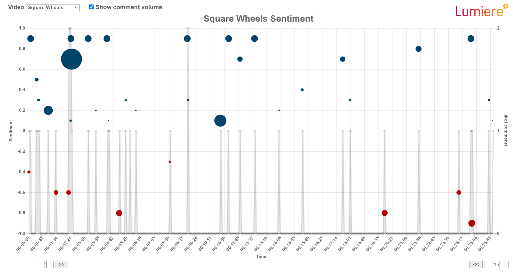

# SENTIMENT BUBBLE CHART GENERATOR

Select an Excel file (.csv, .xls, and .xlsx formats are accepted) to produce a bubble chart that plots the sentiment of a comment against the time the comment was left. The size of the bubble will reflect the sentiment magnitude.

Required columns (in any order):
* time (in seconds)
* video
* comment
* sentimentScore
* sentimentMagnitude

Other columns will be ignored.

Use the text boxes at the bottom of the chart to crop the time scale. Enter hours in the first box, minutes in the second, and seconds in the third, then click the arrow button next to the boxes to crop the scale to that value. Invalid times are not accepted. To reset, click the arrow button with the boxes empty.

Sample chart from included sample data:
